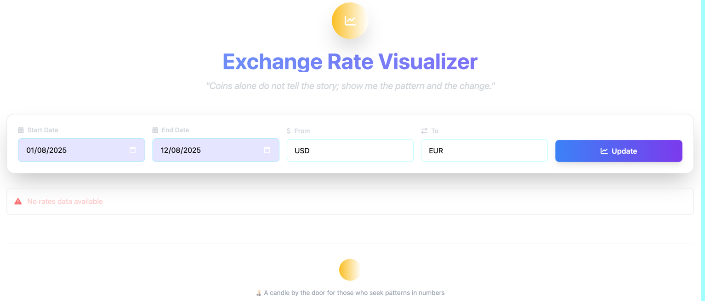

# Exchange Rate API Service

A Flask-based API service that provides exchange rate data with day-by-day breakdowns and statistical analysis. The service fetches data from ExchangeRates API and gracefully falls back to local sample data when the external API is unavailable.

## Features

- 🏥 Health check endpoint
- 💱 Exchange rate data with date ranges
- 📊 Day-by-day breakdown with percentage changes
- 📈 Statistical summaries (start rate, end rate, total change, mean rate)
- 🛡️ Graceful error handling and fallback mechanisms
- 🔢 Division by zero protection
- 🌐 Configurable currency pairs

## Quick Start

### Installation

```bash
# Clone the repository
git clone <your-repo-url>
cd dates_problem

# Create virtual environment
python -m venv venv
source venv/bin/activate  # On Windows: venv\Scripts\activate

# Install dependencies
pip install -r requirements.txt
```

### Running the Service

```bash
python app.py
```

The service will start on `http://localhost:8000`

## API Endpoints

### Health Check

**GET** `/health`

Returns the service health status.

**Example:**
```bash
curl http://localhost:8000/health
```

**Response:**
```json
{
  "status": "healthy",
  "service": "Exchange Rate API",
  "timestamp": "2025-10-21T10:30:00.123456"
}
```

### Finance Data

**GET** `/finance`

Returns exchange rate data with optional day-by-day breakdown.

**Parameters:**
- `start` (required): Start date in YYYY-MM-DD format
- `end` (required): End date in YYYY-MM-DD format
- `breakdown` (optional): 'day' or 'none' (default: 'day')
- `from` (optional): Source currency (default: 'USD')
- `to` (optional): Target currency (default: 'EUR')

## Examples

### Basic Usage

Get USD to EUR rates for a date range with daily breakdown:

```bash
curl "http://localhost:8000/finance?start=2025-07-01&end=2025-07-03"
```

**Response:**
```json
{
  "totals": {
    "start_rate": 0.85234,
    "end_rate": 0.85456,
    "total_pct_change": 0.26,
    "mean_rate": 0.85527
  },
  "breakdown": [
    {
      "date": "2025-07-01",
      "rate": 0.85234,
      "pct_change": 0.0
    },
    {
      "date": "2025-07-02",
      "rate": 0.85891,
      "pct_change": 0.77
    },
    {
      "date": "2025-07-03",
      "rate": 0.85456,
      "pct_change": -0.51
    }
  ],
  "metadata": {
    "start_date": "2025-07-01",
    "end_date": "2025-07-03",
    "from_currency": "USD",
    "to_currency": "EUR",
    "breakdown": "day",
    "timestamp": "2025-10-21T10:30:00.123456"
  }
}
```

### Summary Only

Get only totals without daily breakdown:

```bash
curl "http://localhost:8000/finance?start=2025-07-01&end=2025-07-05&breakdown=none"
```

**Response:**
```json
{
  "totals": {
    "start_rate": 0.85234,
    "end_rate": 0.85789,
    "total_pct_change": 0.65,
    "mean_rate": 0.85699
  },
  "metadata": {
    "start_date": "2025-07-01",
    "end_date": "2025-07-05",
    "from_currency": "USD",
    "to_currency": "EUR",
    "breakdown": "none",
    "timestamp": "2025-10-21T10:30:00.123456"
  }
}
```

### Different Currency Pair

Get GBP to USD rates:

```bash
curl "http://localhost:8000/finance?start=2025-07-01&end=2025-07-03&from=GBP&to=USD"
```

## Data Flow

1. **API Request**: Service attempts to fetch data from ExchangeRates API
2. **Fallback**: If API fails, service uses local sample data from `data/sample_api.json`
3. **Processing**: Calculate percentage changes and statistical summaries
4. **Response**: Return formatted JSON with rates and metadata

## Error Handling

The service includes robust error handling:

- **Division by Zero**: When calculating percentage changes, if the denominator is 0, the service returns 0 for no change or 'N/A' for infinite change
- **API Failures**: Automatic fallback to local sample data
- **Invalid Dates**: Clear error messages for malformed date inputs
- **Missing Parameters**: Helpful error responses with examples

## Sample Data

The service includes sample EUR/USD exchange rate data in `data/sample_api.json` covering dates from 2025-07-01 to 2025-07-10. This ensures the service remains functional even when the external API is unavailable.

## Modern Web Application

In addition to the API service, we've included a modern web application for visualizing exchange rates with an interactive dashboard.

### Web App Features

- 🎨 **Modern UI**: Dark theme with glassmorphism effects and gradient backgrounds
- 📊 **Interactive Charts**: Real-time trend charts and daily change visualizations
- 📱 **Responsive Design**: Works seamlessly on desktop, tablet, and mobile
- ⚡ **Real-time Updates**: Dynamic data fetching with loading states
- 🎯 **Key Metrics**: Statistics cards showing start rate, end rate, total change, and mean rate

### Running the Web Application

```bash
# Start the web application
python webapp.py
```

The web interface will be available at `http://localhost:8001`

### Web App Usage

1. **Select Date Range**: Choose start and end dates for analysis
2. **Choose Currencies**: Select from/to currency pairs (USD, EUR, GBP, JPY)
3. **Update Charts**: Click the update button to fetch new data
4. **Explore Data**: Interact with charts, view statistics, and browse the data table


## Architecture

- **Flask**: Lightweight web framework for both API and web app
- **ExchangeRateService**: Handles API calls and fallback logic
- **FinanceCalculator**: Processes rate data and calculates statistics
- **Modern Frontend**: Alpine.js + Tailwind CSS + Chart.js for interactive UI


---

## Expected visualization


